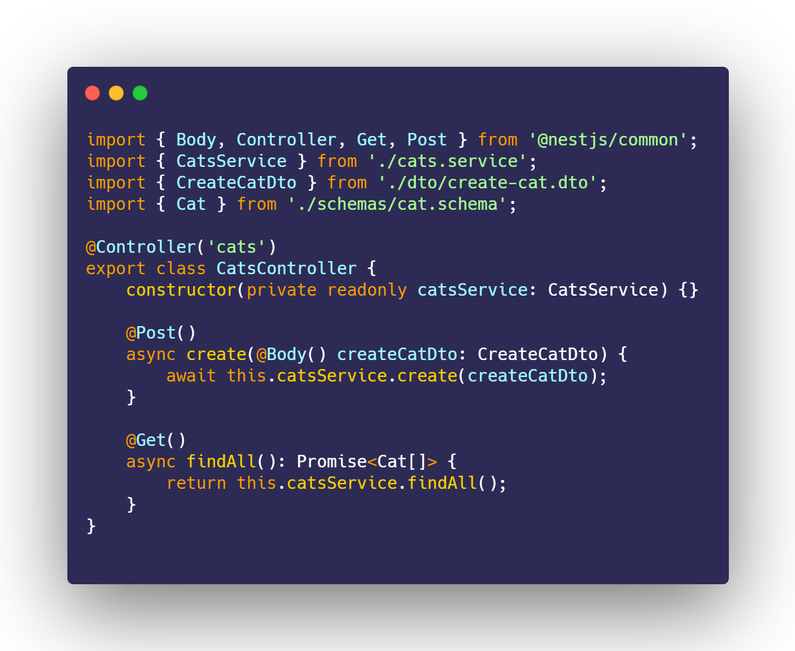

  

  <strong>
To automate the integration between your RestFul API and Front end</strong>

 

  
  
  
  

  Built with :purple_heart: by
  <a href="https://github.com/Felipe-BP">@Felipe-BP</a>
  

    :star2: :eyes: :zap: :boom:
  

 

`@Fastty` is a built in tool that automates integration between your server and client application.

## Features

- :electric_plug: Automates front end code that consumes RESTful endpoints :point_down:

- :mag_right: Nestjs Controller as input and exports Angular Service (HttpClient)

- :space_invader: Query, path params and types supported

    
    <strong style="text-align: justify;">Fastty exports to :point_right:</strong>
    

## Packages

- [**@fastty/core**](#) - core package which provides `parserSource, exportSource` methods that provides all features
- [**@fastty/cli**](#) - cli package that integrates with `@fastty/core` that provides an interface for easy use of all features

## Supports
<strong>Parsers:</strong>
- [x] Nestjs
- [ ] Node

<strong>Exporters:</strong>
- [x] Angular (HttpClient)
- [ ] Axios
- [ ] Fetch API

## Contributing
Pull requests are welcome. For major changes, please open an issue first to discuss what you would like to change.

Please check out [conventional commits](https://www.conventionalcommits.org/en/v1.0.0/) to follow project commit messages design

## Support

Any support is welcome. At least you can give a star on repo :star:

## License

[MIT](LICENSE)